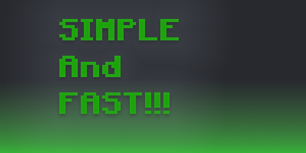
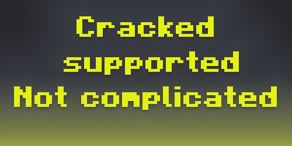
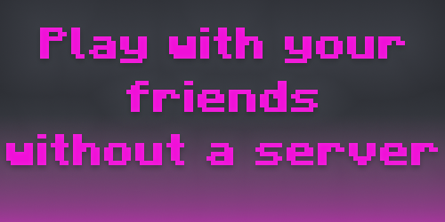
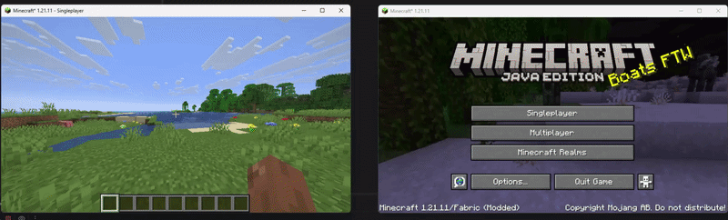
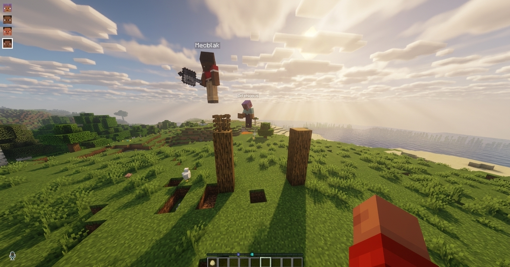

  
  
  
  

## Safra 🚀

Sunucu kurma derdiyle ya da gereksiz ayarlarla uğraşma.  
Minecraft sunucunu **2 tıkla** aç, direkt oyuna gir 😎

✅ Karmaşık arayüz yok  
✅ Saçma sapan sistemler yok  
✅ Hafif ve optimize yapı  
✅ Yaklaşık **250 KB** boyut

> Görselde **TLauncher** kullanılmıştır. (crack destekli)  
> **Voice chat** desteği vardır 🎤 (mod desteği)

## Mod Desteği 🔥

Arkadaşlarınla yüklediğiniz modları rahatça oynayabilirsiniz 🫂  
**Fabric**, **Forge** ve **NeoForge** desteklenir ✅

## FAQ 🤔

İstek, sürüm önerisi ya da hata bildirimi için GitHub’dan yazabilirsin 🛠️  
Açık kaynak kodlu proje burada: [DeveloperKubilay/Safra](https://github.com/DeveloperKubilay/Safra)
